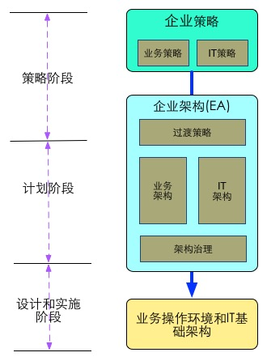
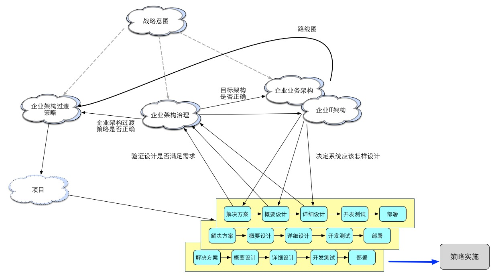

#企业架构-前言
今天跟一个人讨论了什么是企业架构，发现EA在很多人的意识里面还有很多不正确的地方，由于本人曾经就职于IBM GBS，对Enterprise Architecture有比较深入的了解，心情久久不能平静，故觉得开始这一些列博客的创作。不足支出请业内认识多多批评指正。

1. 什么叫做EA(Enterprise Architecture)  
a.IBM如何定义EA  
"The EA discipline defines and maintains the architecture **models, governance and transition initiatives** needed to effectively co-ordinate semi-autonomous groups towards common business and/or IT goals".  
企业架构定义和维护架构模型，治理以及过渡措施，有效地协调半自治组织向通用的业务和IT架构过渡。  
b. 企业架构是绑定用于实现企业业务和IT策略愿景的程序和项目的粘合剂.  
**策略**：识别和计划企业业务和IT项目的组合（portfolio）  
**企业架构**：定义支持策略组合（portolio）的构件块  
**解决方案设计**：运用构件块设计解决方案  
怎么样？很抽象吧？那我来具象的解释一下企业架构

2. 总的来说，企业架构是一种策略工具：  
举个例子，拿建造城市来说，策略相当于城市的总体目标，企业架构相当于城市的建造计划，系统设计相当于城市的建筑物。  
企业架构不只是架构！！！  
事实上，企业架构是企业战略意图的具体提现，是由企业**业务架构**和**IT架构**组成的.  
  
总的来说，企业的战略意图决定企业的业务架构和IT架构，企业架构过度策略则是体现企业业务架构和IT架构转型的路线的路线图，而迭代的项目开发（企业可能采用UP或者Agile方法）则是企业策略实施和交付的手段，而企业架构治理则是管理和检验项目实施是否满足企业架构策略的度量方法。  
  
事实上，接触过或者实施过EA的用户都有这样的感觉，大家都很关注EA并且很多人都认同EA对于IT建设非常关键的，但是EA在确定目标和实施的过程中往往存在巨大的鸿沟，那么是什么原因呢?  
  * EA的实施需要有管理层的支持，在EA实施的初期，咨询师的作用要大于架构师；  
  * EA是确保业务和IT策略的可行性合理性的语言，也就是说，EA需要管理层、计划编排者或者项目经理的理解，而架构师不应该在决策方案的建设上起决定作用(是不是有点反直觉，笔者认为，EA需要架构师以企业战略的高度和业务、流程的视角去看待问题，而不是以技术为初始切入点，这点往往是做技术出身的架构师们的通病，造成一叶障目).  

下面我们再反过来回顾一下上文EA定义语句中的红色部分的词汇，看看通过上面的描述，应该如何理解这些词汇：  
	* architecture models：EA本质上是一种参考模型，它提供了多种形式的模型  
	* governance：EA确保架构能够被维护和使用  
	* transition initiatives：EA强调主动(proactive)而不是被动的反应(reactive)  
	* semi-autonomous groups: EA强调多部门联动和合作  
	* business and/or IT goals：EA致力于解决业务和IT的问题
